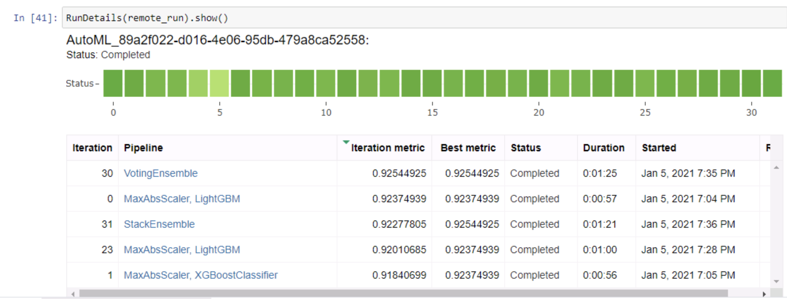

  

# Optimizing an ML Pipeline in Azure

## Overview
This project is part of the Udacity Azure ML Nanodegree.
In this project, I built and optimized an Azure ML pipeline using the Python SDK and a provided Scikit-learn model.
This model is then compared to an Azure AutoML run.

## Summary

In this project I worked with the "Bank Marketing Data Set". This data is related "with direct marketing campaigns (phone calls) of a Portuguese banking institution". 
The classification goal is to predict if the client will subscribe a term deposit (binary classification).

The classificaiton problem was solved in two ways, first by using a Scikit-Learn pipeline and, second, by using AutoML. 
In the first case a Linear model was selected, the best performing model reach a 0.9109 accuracy value on the test set.
AutoML reached a 0.9189 accuracy value on the test set. VotingEnsemble was the best performing model.

## Scikit-learn Pipeline

The scikit-learn pipeline has four main steps: data preparation, model fitting, hyperparameter tunning and evaluation. 

The first two steps are implemented within a Python script, where a custom Python and Pandas functions are used to clean and define the model. 
For hyperparameter tunning Hyperdrive was used (from the SDK). I used a Random sampler, selecting random samples from a uniform distribution is always the most simple (but effective) way to start exploring a problem. 
I also specified a banditpolicy for early stopping. It evaluates the results every 3 child runs, and use a slack factor of 15%. 

Finally, the model was evaluated using SDK functionalities. 

## AutoML

AutoML was very straightforward to use, I just defined the training and validation data (without further preprocessing), the label column, and the type of task and AutoML did the rest. 
AutoML tried 30 different models in a single experiment, and the result was better than the scikit-learn pipeline: 

The best performing model was a VotingEnsamble of XGBoostClassifier, LightGBM, LogisticRegression, and RandomForest with the following weights: 

- XGBoostClassifier:  0.2857
- XGBoostClassifier:  0.2142
- XGBoostClassifier:  0.1428
- LightGBM:           0.0714
- LightGBM:           0.0714
- XGBoostClassifier:  0.0714
- LogisticRegression: 0.0714
- RandomForest:       0.0714

## Pipeline comparison

AutoML was more convenient because it took the same time for setting it up, but the results were better. The only disadvantage is that it spent more time using Azure Resources, which increases the costs. 

## Future work

The goal of this project was to explore two different workflows in Azure ML, however, the problem that is being solved can be explored deeply. I think it would be interesting to perform more feature engineering on several columns. Azure ML includes tools for detecting which features are more relevant (for each model), this can be the first step to derive new features and train new models. 
